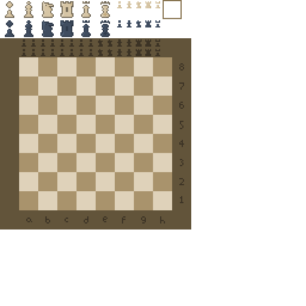

# EPQ Menu - The Board

## Revision 1

### Creating of the Board

I began by using a pre-created template I use for the majority of my Python files.

```python
# default modules
import numpy as np
import os
from random import choice

from typing import NewType, Iterable, Literal

# bots
from requiem_bot.bot import *

try:
    # installed modules
    import tkinter as tk

    from PIL import Image, ImageTk

except ModuleNotFoundError:
    print("Installing required modules from requirements.txt (sibling file). Please wait...")
    requirements = os.path.dirname(__file__) + "/requirements.txt"
    os.system("pip install -r \"" + requirements + "\"")
    print("Modules installed. Please restart the script.")
    exit()
```

Next, I created a class to hold the information of the chess board.

```python
class Board:
    """The board class."""

    FENType = NewType('FENType', str)
    SAN = NewType('SAN', str)
    Coordinate = NewType('Coordinate', tuple[int, int])
    Move = NewType('Move', tuple[tuple[int, int], tuple[int, int]])
```

I began by initialising some `NewType` instances which I could then use to *type-annotate* my functions to improve readability.

```python
    WHITE = list(range(7,13))
    BLACK = list(range(1,7))

    piecetotoken = { # uppercase: white, lowercase: black
        " " : 0,
        "p" : 1,
        "n" : 2,
        "b" : 3,
        "r" : 4,
        "q" : 5,
        "k" : 6,
        "P" : 7,
        "N" : 8,
        "B" : 9,
        "R" : 10,
        "Q" : 11,
        "K" : 12
    }
    tokentopiece = ''.join(piecetotoken.keys())
```

Next, I represented each colour piece (and pawn) with 12 tokens, in the form of integers. I then created dictionaries (`piecetotoken` and `tokentopiece`) to interchange between string and integer representation for the pieces.

I then began focussing on means of representing the piece's movement. I eventually settled on a list of coordinates attached to each piece token dictating in which directions the piece could move.

```python
singlecolmovedirs = {
    6 : [(-1, -1), (-1, 0), (-1, 1), (0, -1), (0, 1), (1, -1), (1, 0), (1, 1)],
    5 : [(-1, -1), (-1, 0), (-1, 1), (0, -1), (0, 1), (1, -1), (1, 0), (1, 1)],
    4 : [(-1, 0), (0, -1), (0, 1), (1, 0)],
    3 : [(-1, -1), (-1, 1), (1, -1), (1, 1)],
    2 : [(-2, -1), (-2, 1), (-1, -2), (-1, 2), (1, -2), (1, 2), (2, -1), (2, 1)],
    1 : [(-1, -1), (-1, 1), (1, -1), (1, 1), (0, 1), (0, 2), (0, -1), (0, -2)]
}
movedirs = {}

# opposite colours
for k, v in singlecolmovedirs.items():
    movedirs[k + 6] = v
    movedirs[k] = v

can_move_long = [3,4,5,9,10,11]
```

I used iteration to duplicate the movement for the black tokens as well. Additionally, I created a list containing piece tokens which had the ability to 'move long'; i.e. theoretically move infinitely assuming the size of the board permitted it.

I then created **FEN** notation to represent the standard
starting position of a Chess board, as well as create a list
of tokens at the start of the game.

```python
startFEN = "rnbqkbnr/pppppppp/8/8/8/8/PPPPPPPP/RNBQKBNR w KQkq - 0 1"

ALL_TOKENS = [4,2,3,5,6,3,2,4,
                1,1,1,1,1,1,1,1,
                7,7,7,7,7,7,7,7,
                10,8,9,11,12,9,8,10]

# player 1: white, player 0: black
```

I then moved on to the `__init__` statement of the Board.

```python
def __init__(self, x: int = 8, y: int = 8, board = None) -> None:
        """The board constructor."""

        self.x = x
        self.y = y

        if board is not None:
            self.board = board
        else:
            self.board = self.FENtoboard(Board.startFEN)
```

I *globalised* the variables passed into the initialise
statement, as well as give the option to build a board
based off of an optional parameter.

For testing purposes, I wrote a function that returns a
text representation of the board when called.

```python
def __str__(self) -> str:
        """Return a string representation of the board."""

        s = '+---' * self.x + '+\n'

        for y in range(self.y -1, -1, -1):
            for x in range(self.x):
                piece = self.tokentopiece[self.board[x][y]]
                s += f"| {self.piecetosymbol[piece]} "
            s += f'| {y + 1}\n'
            s += '+---' * self.x + '+\n'
        
        s += ''.join(f"  {chr(i + 96)} " for i in range(1, self.x + 1)) + '\n'

        return s
```

I continued with another *dunder* function to simplify
the retrieval of data from the board:

```python
def __getitem__(self, pos: Coordinate) -> int:
        """Return the counter at a position."""
        x, y = pos
        return self.board[x - 1][y - 1]
```

The following functions are self explanatory:

```python
def move(self, board: np.ndarray, start: Coordinate, end: Coordinate, promotion: int | None) -> np.ndarray:
        """Make a move and return the new board."""

        self.last_move = (start, end, board[end[0] - 1][end[1] - 1])
        
        if promotion is not None:
            board[end[0] - 1][end[1] - 1] = promotion
        else:
            board[end[0] - 1][end[1] - 1] = board[start[0] - 1][start[1] - 1]

        board[start[0] - 1][start[1] - 1] = 0

        return board
    
    def undo(self, board: np.ndarray) -> np.ndarray:
        """Undo a move and return the new board."""

        start, end, taken_piece = self.last_move

        board[start[0] - 1][start[1] - 1] = board[end[0] - 1][end[1] - 1]
        board[end[0] - 1][end[1] - 1] = taken_piece
        self.last_move = ()

        return board

    def boardtoFEN(self) -> FENType:
        """Convert the board to FEN."""

        FEN = ""

        for i in range(8):
            count = 0
            for j in range(8):
                if self.board[i][j] == 0:
                    count += 1
                else:
                    if count > 0:
                        FEN += str(count)
                        count = 0
                    FEN += self.tokentopiece[self.board[i][j]]
            if count > 0:
                FEN += str(count)
            FEN += "/"

        FEN = FEN[:-1]
        return FEN
    
    def FENtoboard(self, FEN: FENType) -> np.ndarray:
        """Convert the FEN to board."""

        self.board = np.zeros((self.x, self.y), dtype=int)
        FEN_index = 0
        x = 0
        y = 0
        
        while True:
            cell = FEN[FEN_index]
            FEN_index += 1

            if cell == " ":
                return self.board
            elif cell == "/":
                y += 1
                x = 0
                continue
            elif cell.isdigit():
                x += int(cell)
                continue
            else:
                self.board[x][self.y-y-1] = self.piecetotoken[cell]
                x += 1

            if FEN_index == len(FEN):
                return self.board
    
    def move_to_SAN(self, start: Coordinate, end: Coordinate, promotion: int | None) -> SAN:
        """Convert a move to SAN notation."""

        x2, y2 = end

        token = int(self[x2, y2])
        piece = self.tokentopiece[token]
        player = 1 if token in self.WHITE else 0
        has_taken = self.last_move[2] != 0

        self.undo(self.board)
        is_check = self.can_king_be_taken(1 - player, start, end, promotion)
        self.move(self.board, start, end, promotion)

        #########################

        if piece in "Pp" and has_taken:
            san = chr(start[0] + 96)
        elif piece in "Pp" and not has_taken:
            san = ''
        else:
            san = piece.upper()
        if has_taken:
            san += "x"
        san += f"{chr(x2 + 96)}{y2}"
        if promotion is not None:
            san += f"={self.tokentopiece[promotion]}"
            san = san[1:] # remove the initial piece letter
        if is_check:
            san += "+"

        return san
```

Around this time, I began to realise my initial approach was
poor, and I created a new file to start anew, utilising
*bitboards* to better and faster represent the pieces.

## Revision 2

### The Board

The same boilerplate header:

```python
# default modules
import numpy as np
import os

from typing import Literal

try:
    # installed modules
    import tkinter as tk
    from PIL import Image, ImageTk

except ModuleNotFoundError:
    print("Installing required modules from requirements.txt (sibling file). Please wait...")
    requirements = os.path.dirname(__file__) + "/requirements.txt"
    os.system("pip install -r \"" + requirements + "\"")
    print("Modules installed. Please restart the script.")
    exit()

####################################################################################################


###################################################################################################
```

#### Bitboards

I began by creating a Bitboard class, represented by a `numpy` *zeros* 8 by 8 array.

```python
class Bitboard:

    def __init__(self, bb: np.ndarray | None = None) -> None:
        """Bitboard class.
        Args:
            bb (np.ndarray | None, optional): The bitboard. Defaults to None.
            x (int, optional): The width of the bitboard. Defaults to 8.
            y (int, optional): The height of the bitboard. Defaults to 8.
            \nbb argument takes priority over x and y."""
        
        self.bb = np.zeros((8, 8), dtype=int) if bb is None else bb
```

I ensured to provide the option to change the X and Y dimensions of the bitboard in case I would need to use bitboards of different sizes.

What follows is a variety of *dunder* functions with examples for each function indicated by three right-facing arrows `>>>`. The bitboard is represented by `bb`.

```python
def __setitem__(self, key: tuple[int, int], value: int) -> None:
    self.bb[key] = value

>>> bb[2,3] = 1
```

The bit at index 2, 3 is now 1.

```python
def __getitem__(self, key: tuple[int, int]) -> int:
    return self.bb[key]

print(bb[2,3])
>>> Output: 1
```

The function has retrieved the bit at index 2, 3.

```python
def __add__(self, other: 'Bitboard') -> 'Bitboard':
    return Bitboard(self.bb + other.bb)
def __radd__(self, other: 'Bitboard') -> 'Bitboard':
    return Bitboard(self.bb + other.bb)

bb1 = Bitboard()
bb1[0,0] = 1
bb2 = Bitboard()
bb2[0,1] = 1
bb3 = bb1 + bb2
print(bb3[0,0], bb3[0,1])
>>> Output: 1 1
```

These functions act like `or` gates for bitboards. Any instance of 1 in either bitboard results in a 1 in the final bitboard.

```python
def __invert__(self) -> 'Bitboard':
    return Bitboard(~self.bb)
```

Reverses the polarity of each bit in the bitboard. At the time of writing, this function has no use.

```python
def __str__(self) -> str:
    return str(self.bb)
```

This function allows the bitboard to be printed.

Lastly, a non-dunder function completes the bitboard thus far.

```python
def on(self) -> bool:
    """Return whether the board contains any bits."""
    return np.any(self.bb)
```

This function is crucial to determine whether a certain piece type remains on the board. It is much faster and more concise than the previous approach:

```python
def onboard(self, piece: int) -> bool:
    """Check if the piece is on the board."""

    for x in range(self.x):
        for y in range(self.y):
            if self.board[x][y] == piece:
                return True
    return False
```

Rather than needing to iterate through the whole board, `numpy` provides a function that returns `True` if all values of the bitboard are not 0.

This is especially helpful to determine checks and checkmate; we can simply check if the respective coloured King bitboard is empty.

It also resolves issues where tokens would not properly be tracked and the game would think some pieces are still present.

#### The Pieces

Similar to my first approach, I needed a way to represent the pieces on the board before converting the board into bitboards.

My first approach was something like this;

```python
class Piece:

    def __init__(self, color: Literal['white', 'black'], movement: list[tuple[int,int]], movelong: bool) -> None:
        """Chess piece class.
        Args:
            color (Literal['white', 'black']): The color of the piece.
            movement (list[tuple[int,int]]): The short-hand movement of the piece.
            movelong (bool): Whether the piece can move 'long' or not.
        """

        global PIECE_ID_INDEX

        self.id = PIECE_ID_INDEX + 1
        PIECE_ID_INDEX += 1

        self.color = color
        self.movelong = movelong
        self.movement = self.expand_movement(movement)

        self.bb = Bitboard()
    
    def expand_movement(self, short_movement: list[tuple[int,int]]) -> list[tuple[int,int]]:
        """Expand the short movement list for all cases of movement."""

        mvmt = []
        for dx, dy in short_movement:
            for _ in range(2):
                mvmt.append((dx, dy))
                mvmt.append((dx, -dy))
                mvmt.append((-dx, dy))
                mvmt.append((-dx, -dy))
                dy, dx = dx, dy
        
        if not self.movelong:
            return list(set(mvmt))
        
        extended = []
        for scalar in range(1, 9):
            for dx, dy in list(set(mvmt)):
                extended.append((dx * scalar, dy * scalar))
        return extended

    def copy(self, 
             color: Literal['white', 'black'] | None = None, 
             movement: list[tuple[int,int]] | None = None, 
             movelong: bool | None = None) -> 'Piece':
        return Piece(self.color if color is None else color,
                     self.movement if movement is None else movement,
                     self.movelong if movelong is None else movelong)
```

```python
class White:
    def __init__(self) -> None:
        self.pawn = Pawn('white')
        self.knight = Piece('white', [(2,1)], False)
        self.bishop = Piece('white', [(1,1)], True)
        self.rook = Piece('white', [(1,0)], True)
        self.queen = Piece('white', [(1,0), (1,1)], True)
        self.king = self.queen.copy(movelong=False)

        self.pieces = [self.pawn, self.knight, self.bishop, self.rook, self.queen, self.king]

    def print_ids(self) -> None:
        """Print the IDs of each piece."""

        names = ['pawn', 'knight', 'bishop', 'rook', 'queen', 'king']
        for name, piece in zip(names, self.pieces):
            print(f"white {name} : {piece.id}")

self.white = w = White()

class Black:
    def __init__(self) -> None:
        self.pawn = Pawn(color='black')
        self.knight = w.knight.copy(color='black')
        self.bishop = w.bishop.copy(color='black')
        self.rook = w.rook.copy(color='black')
        self.queen = w.queen.copy(color='black')
        self.king = w.king.copy(color='black')

        self.pieces = [self.pawn, self.knight, self.bishop, self.rook, self.queen, self.king]

    def print_ids(self) -> None:
        """Print the IDs of each piece."""

        names = ['pawn', 'knight', 'bishop', 'rook', 'queen', 'king']
        for name, piece in zip(names, self.pieces):
            print(f"black {name} : {piece.id}")

self.black = Black()
```

However, I soon realised this approach was impractical. The two classes share a near-identical function `print_ids` and otherwise have very similar data.

I devised a new approach;

```python
PIECE_ID_INDEX = 0

class Piece:

    def __init__(self, color: Literal['white', 'black'], movement: list[tuple[int, int]], movelong: bool) -> None:
        """Chess piece class.
        Args:
            color (Literal['white', 'black']): The color of the piece.
            movement (list[tuple[int, int]]): The short-hand movement of the piece.
            movelong (bool): Whether the piece can move 'long' or not.
        """

        global PIECE_ID_INDEX
        self.id = PIECE_ID_INDEX + 1
        PIECE_ID_INDEX += 1

        self.color = color
        self.movelong = movelong
        self.movement = self.expand_movement(movement)
        self.bb = Bitboard()

    def expand_movement(self, short_movement: list[tuple[int, int]]) -> list[tuple[int, int]]:
        """Expand the short movement list for all cases of movement.
        Args:
            short_movement (list[tuple[int,int]]): The short-movement list.
        Returns:
            list[tuple[int,int]]: The expanded movement list.
        """

        mvmt = []
        for dx, dy in short_movement:
            for _ in range(2):
                mvmt.append((dx, dy))
                mvmt.append((dx, -dy))
                mvmt.append((-dx, dy))
                mvmt.append((-dx, -dy))
                dy, dx = dx, dy

        # if not 'long', return the unique short movements
        if not self.movelong:
            return list(set(mvmt))

        # if 'long', scale the movements
        extended = [(dx * scalar, dy * scalar) for scalar in range(1, 9) for dx, dy in list(set(mvmt))]
        return extended

    def copy(self, color: Literal['white', 'black'] = None, movement: list[tuple[int, int]] = None, movelong: bool = None) -> 'Piece':
        """Create a copy of the piece, with optional overrides."""

        return Piece(
            self.color if color is None else color,
            self.movement if movement is None else movement,
            self.movelong if movelong is None else movelong
        )

class Player:

    def __init__(self, color: Literal['white', 'black']) -> None:
        """Player class to manage pieces for a given colour.
        Args:
            color (Literal['white', 'black']): The colour of the piece.
        """

        self.color = color
        self.pieces = self.create_pieces(color)

    def create_pieces(self, color: Literal['white', 'black']) -> list[Piece]:
        """Create pieces based on the color of the player.
        Args:
            color (Literal['white', 'black']): The colour of the piece.
        Returns:
            list[Piece]: A list of the created pieces.
        """

        pawn = Pawn(color=color)
        knight = Piece(color=color, movement=[(2, 1)], movelong=False)
        bishop = Piece(color=color, movement=[(1, 1)], movelong=True)
        rook = Piece(color=color, movement=[(1, 0)], movelong=True)
        queen = Piece(color=color, movement=[(1, 0), (1, 1)], movelong=True)
        king = queen.copy(color=color, movelong=False)

        return [pawn, knight, bishop, rook, queen, king]

    def print_ids(self) -> None:
        """Print the IDs of each piece for this player."""
        names = ['pawn', 'knight', 'bishop', 'rook', 'queen', 'king']
        for name, piece in zip(names, self.pieces):
            print(f"{self.color} {name} : {piece.id}")


class Board:

    def __init__(self) -> None:

        self.white = Player('white')
        self.black = Player('black')
        self.board = np.zeros((8, 8), dtype=int)
```

Now the organisation is much more concise and I do not repeat myself.

However, I realised I don't need a separate function to define the pieces; in fact, it makes my situation harder since I would have to access the pieces by list. Instead, I defined them inside of `Player.__init__`:

```python
class Player:

    def __init__(self, color: Literal['white', 'black']) -> None:
        """Player class to manage pieces for a given colour.
        Args:
            color (Literal['white', 'black']): The colour of the piece.
        """

        self.color = color

        self.pawn = Pawn(color=color)
        self.knight = Piece(color=color, movement=[(2, 1)], movelong=False)
        self.bishop = Piece(color=color, movement=[(1, 1)], movelong=True)
        self.rook = Piece(color=color, movement=[(1, 0)], movelong=True)
        self.queen = Piece(color=color, movement=[(1, 0), (1, 1)], movelong=True)
        self.king = self.queen.copy(color=color, movelong=False)

        self.pieces = [self.pawn, self.knight, self.bishop, self.rook, self.queen, self.king]

    def print_ids(self) -> None:
        """Print the IDs of each piece for this player."""
        names = ['pawn', 'knight', 'bishop', 'rook', 'queen', 'king']
        for name, piece in zip(names, self.pieces):
            print(f"{self.color} {name} : {piece.id}")
```

I now needed a way to take the state of a board (presumably a numpy 8x8 array using the IDs of the pieces).

To avoid using long statements such as `self.black.rook.id` to collect the IDs, I defined a dictionary as such:

```python
self.pieces = self.white.pieces.copy() + self.black.pieces.copy()

self.id = {}
for piece in self.pieces:
    self.id[piece] = id
```

Just as I created it, I realised this approach is no better than the first approach. Instead, I would define the structure then iteratively convert each piece into its ID.

```python
def default(self) -> list[list[int]]:
    """Return the default Chess board in piece IDs."""

    black = self.black
    white = self.white

    struct: list[list[Piece | Pawn]] = [
        [white.rook, white.knight, white.bishop, white.queen, white.king, white.bishop, white.knight, white.rook],
        [white.pawn] * 8,
        [0] * 8,
        [0] * 8,
        [0] * 8,
        [0] * 8,
        [black.pawn] * 8,
        [black.rook, black.knight, black.bishop, black.queen, black.king, black.bishop, black.knight, black.rook],
        ]
    
    struct_ids: list[list[int]] = []
    for row in struct:
        row_ids: list[int] = []
        for piece in row:
            row_ids.append(piece.id)
        struct_ids.append(row_ids)
    
    return np.array(struct_ids)
```

I opted to return a Board instance instead, such that I could create the board in one statement.

```python
board = np.array(struct_ids)
return Board(board=board)
```

```python
board = Board().default()
```

Next, I needed to represent the board in a set of bitboards stored in each pieces' data, then safely forget about the board state.

I iterated through each cell in the board:

```python
def write_bitboards_from_board(self) -> None:
    """Write the piece bitboards from a board state."""

    for x in range(8):
        for y in range(8):
            cell = self.board[x, y]
```

Then created a dictionary to access pieces by their ID:

```python
id = {piece.id : piece for piece in self.pieces}
```

Lastly, change the bit to 1 where the ID accords to the piece:

```python
id[cell].bb[x, y] = 1
```

The complete function:

```python
def write_bitboards_from_board(self) -> None:
    """Write the piece bitboards from a board state."""

    id = {piece.id : piece for piece in self.pieces}

    for x in range(8):
        for y in range(8):
            cell = self.board[x, y]
            id[cell].bb[x, y] = 1
```

I appended the function just after the board definition.

```python
self.board = np.zeros((8, 8), dtype=int) if board is None else board
self.write_bitboards_from_board()
```

#### Troubleshooting

This error arose:

```bash
File "/workspaces/EPQ/mainbitboard.py", line 186, in write_bitboards_from_board
    id[cell].bb[x, y] = 1
    ~~^^^^^^
KeyError: np.int64(0)
```

I resolved it by ensuring the cell was converted to a normal integer before trying to access the ID.

```python
cell = int(self.board[x, y])
```

Another error:

```bash
  File "/workspaces/EPQ/mainbitboard.py", line 186, in write_bitboards_from_board
    id[cell].bb[x, y] = 1
    ~~^^^^^^
KeyError: 0
```

I forgot to account for the missing 0 ID indicating an empty space, so I added a statement to ignore if the ID is 0:

```python
cell = int(self.board[x, y])
if cell == 0: continue
id[cell].bb[x, y] = 1
```

The bitboard loading function worked correctly now, however:

```bash
File "/workspaces/EPQ/mainbitboard.py", line 291, in main
    board = Board().default()
            ^^^^^^^^^^^^^^^^^
  File "/workspaces/EPQ/mainbitboard.py", line 214, in default
    row_ids.append(piece.id)
                   ^^^^^^^^
AttributeError: 'int' object has no attribute 'id'
```

Initially, I was unsure why the `piece` variable was an integer, so I printed it before the error.

```bash
...
<__main__.Pawn object at 0x7a6fe30102f0>
<__main__.Pawn object at 0x7a6fe30102f0>
<__main__.Pawn object at 0x7a6fe30102f0>
<__main__.Pawn object at 0x7a6fe30102f0>
0
Traceback (most recent call last):
  File "/workspaces/EPQ/mainbitboard.py", line 301, in <module>
    main()
    ...
```

I then realised that the zeros in the structure were in fact integers, and I would need to account for this.

```python
for piece in row:
    if piece == 0:
        row_ids.append(0)
    else:
        row_ids.append(piece.id)
```

```bash
File "/workspaces/EPQ/mainbitboard.py", line 177, in __init__
    self.write_bitboards_from_board()
  File "/workspaces/EPQ/mainbitboard.py", line 188, in write_bitboards_from_board
    id[cell].bb[x, y] = 1
    ~~^^^^^^
KeyError: 4
```

I printed the dictionary as well as creating dunder `__str__` functions for the `Piece` and `Pawn` classes.
Piece:

```py
def __str__(self) -> str:
    return f"{self.color} piece ID{self.id}"
```

Pawn:

```py
def __str__(self) -> str:
    return f"{self.color} pawn ID{self.id}"
```

ID dictionary:

```py
print('\t'.join([str(k) + ' ' + str(v) for k, v in id.items()]))
```

Output:

```bash
13 white pawn ID13      14 white piece ID14     15 white piece ID15     16 white piece ID16     17 white piece ID17     18 white piece ID18     19 black pawn ID19      20 black piece ID20     21 black piece ID21       22 black piece ID22     23 black piece ID23     24 black piece ID24
```

The mistake was that I had neglected to reset the `PIECE_ID_INDEX` counter after the creation of the board. Since the board was being called as `Board().default()`, 2 board states were being corrected and I would have to reset the counter between the two.

I inserted this at the top of the `Board.__init__` function:

```py
global PIECE_ID_INDEX
PIECE_ID_INDEX = 0
```

No errors arose this time, but I would have to check the bitboards to ensure their data was loaded correctly.

```bash
ID: 1
[[0 0 0 0 0 0 0 0]
 [1 1 1 1 1 1 1 1]
 [0 0 0 0 0 0 0 0]
 [0 0 0 0 0 0 0 0]
 [0 0 0 0 0 0 0 0]
 [0 0 0 0 0 0 0 0]
 [0 0 0 0 0 0 0 0]
 [0 0 0 0 0 0 0 0]]
ID: 2
[[0 1 0 0 0 0 1 0]
 [0 0 0 0 0 0 0 0]
 [0 0 0 0 0 0 0 0]

 ...

 [0 0 0 0 0 0 0 0]
 [0 0 0 0 0 0 0 0]
 [0 0 0 1 0 0 0 0]]
ID: 12
[[0 0 0 0 0 0 0 0]
 [0 0 0 0 0 0 0 0]
 [0 0 0 0 0 0 0 0]
 [0 0 0 0 0 0 0 0]
 [0 0 0 0 0 0 0 0]
 [0 0 0 0 0 0 0 0]
 [0 0 0 0 0 0 0 0]
 [0 0 0 0 1 0 0 0]]
```

The bitboards are working correctly. For example, ID `1` indicates white pawns, and there is a distinct row of 1s shown in its bitboard.

The bitboards display in reverse; bottom to top, left to right. This is why the white pawns are at the top, but when displayed properly, they will be at the bottom.

### Game Logic

#### Legal Moves (without check)

The function began as so:

```python
def legal_nocheck(self) -> list[list[tuple[int,int], tuple[int,int]]]:
    """Get all legal moves without checking for checks.
    Returns:
        list[list[tuple[int,int], tuple[int,int]]]: A list of pairs of coordinates describing the movement."""
```

I then figured I would need a function to return pieces that are still present on the board:

```python
def present_pieces(self) -> list[Piece | Pawn]:
    """Get the present piece types; i.e. pieces that do not have an empty bitboard.
    Returns:
        list[Piece | Pawn]: The list of present pieces.
    """

    present = []
    for piece in self.pieces:
        if piece.bb.any(): # does the bitboard have any 1s?
            piece.append(present)
    return present
```

The beginnings of the function:

```py
def legal_nocheck(self) -> list[list[Coordinate, Coordinate]]:
    """Get all legal moves without checking for checks.
    Returns:
        list[list[Coordinate, Coordinate]]: A list of pairs of coordinates describing the movement.
    """

    present = self.present_pieces()

    for piece in present:
        if isinstance(piece, Pawn):
            pass
        elif isinstance(piece, Piece):
            for dx, dy in piece.movement():
                # ?
```

Here, I would need a means of finding the coordinates of all 1s in each bitboard. Using iteration would render the bitboard redundant, however, `numpy` has a function that does precisely what I need from it. I wrote a new `Bitboard` function:

```py
def pos(self) -> list[Coordinate]:
    """Return the indices of any 1s in the bitboard.
    Returns:
        list[Coordinate]: The list of indices pointing to 1s.
    """

    pos = np.nonzero(self.bb)
    return list(zip(pos[0], pos[1]))
```

I then updated the `legal_nocheck` function:

```python
present = self.present_pieces()

for piece in present:
    if isinstance(piece, Pawn):
        pass
    elif isinstance(piece, Piece):
        for x, y in piece.bb.pos():
            for dx, dy in piece.movement:
                rx, ry = x + dx, y + dy
```

`rx` and `ry` now pointed to the resultant coordinates of a piece's movement.

The final few checks involved off-board checks and obstruction checks, which is where I realised my earlier approach to determining movement was inefficient:

```py
"""In Piece.expand_movement:"""

# if 'long', scale the movements
extended = [(dx * scalar, dy * scalar) for scalar in range(1, 9) for dx, dy in list(set(mvmt))]
return extended
```

I realised it would be better to instead not scale the movement and scale it whilst checking for obstructions in the legal move checker. I removed the scaling section of `Piece.expand_movement`, and planned to readd it in `legal_nocheck`.

```py
def legal_nocheck(self, color: Literal['white', 'black']) -> list[list[Coordinate, Coordinate]]:
    """Get all legal moves without checking for checks.
    Returns:
        list[list[Coordinate, Coordinate]]: A list of pairs of coordinates describing the movement.
    """

    white_bb = Bitboard().sum([piece.bb for piece in self.white.pieces])
    black_bb = Bitboard().sum([piece.bb for piece in self.black.pieces])

    self_bb = white_bb if color == 'white' else black_bb
    other_bb = black_bb if color == 'white' else white_bb
```

I added a colour parameter; the colour depends on the legal moves, of course. White pieces cannot take white pieces, for example, and most importantly, only the white player can move white pieces.

Some reorganisation later:

```py
def legal_nocheck(self, color: Literal['white', 'black']) -> list[list[Coordinate, Coordinate]]:
    """Get all legal moves without checking for checks.
    Returns:
        list[list[Coordinate, Coordinate]]: A list of pairs of coordinates describing the movement.
    """

    if color not in ['white', 'black']:
        raise ValueError(f"Incorrect color specified (got {color}, only 'white' and 'black' permitted).")

    self_pieces = self.white.pieces if color == 'white' else self.black.pieces
    other_pieces = self.black.pieces if color == 'white' else self.white.pieces

    self_bb = Bitboard().sum([piece.bb for piece in self_pieces])
    other_bb = Bitboard().sum([piece.bb for piece in other_pieces])

    moveable_pieces = list(set(self.present_pieces()) & set(self_pieces))
    
    # No legals list: I decided to yield instead.
```

Starting on the logic:

```py
for piece in moveable_pieces:
    if isinstance(piece, Pawn):
        pass #TODO
    elif isinstance(piece, Piece):
        for x, y in piece.bb.pos():
            for dx, dy in piece.movement:
                rx, ry = x + dx, y + dy

                # cannot 'capture' own piece
                if (rx, ry) in self_bb_pos:
                    continue

                # cannot movelong
                if not piece.movelong:
                    yield [(x, y), (rx, ry)]
                    continue
```

Now, I needed to work on the scalar. I also ensured to add an out of bounds check for the moveshort pieces.

```py
# out of bounds
if rx not in range(8) or ry not in range(8):
    continue
```

For clarity, I moved some code to a new function:

```py
def piece_legal_nocheck(self, piece: Piece) -> Iterable[list[Coordinate, Coordinate]]:
    """Get all legal moves for a single piece, specified by class.
    Args:
        piece (Piece): The piece to check for legal moves.
    Returns:
        Iterable[list[Coordinate, Coordinate]]: An iterable of pairs of coordinates describing the movement."""

    self_pieces = self.white.pieces if piece.color == 'white' else self.black.pieces
    other_pieces = self.black.pieces if piece.color == 'white' else self.white.pieces

    self_bb = Bitboard().sum([piece.bb for piece in self_pieces])
    self_bb_pos = self_bb.pos()

    for x, y in piece.bb.pos():
        for dx, dy in piece.movement:
            rx, ry = x + dx, y + dy

            # cannot 'capture' own piece
            if (rx, ry) in self_bb_pos:
                continue
            # out of bounds
            if rx not in range(8) or ry not in range(8):
                continue

            # cannot movelong
            if not piece.movelong:
                yield [(x, y), (rx, ry)]
                continue
```

Onto the scalar section. I decided I would iterate with a scalar `s` from 1 to 8, and multiply the magnitude of the direction by `s`. If the path is unobstructed, I would yield the movement, otherwise stop the iteration and continue to the next movement direction.

```py

"""In piece_legal_nocheck:"""
for s in range(1, 9):
    # scaled direction and resultant X and Y
    sdx, sdy = dx * s, dy * s
    rx, ry = x + sdx, y + sdy

    # cannot be out of bounds
    if rx not in range(8) or ry not in range(8):
        break

    # cannot 'capture' own piece
    if (rx, ry) in self_bb_pos:
        break
    # if capturing enemy piece, yield then break
    if (rx, ry) in other_bb_pos:
        yield [(x, y), (rx, ry)]
        break

    # otherwise yield
    yield [(x, y), (rx, ry)]
```

To link it back to `legal_nocheck`:

```py
"""In legal_nocheck:"""
for move in self.piece_legal_nocheck(piece):
    yield move
```

#### Cleaning Up

I wanted to take a brief step away from obtaining legal moves, and focus on some other sections that needed more attention.

Firstly, I changed the `Pawn` class to be derived from the `Piece` class for ease.

```py
class Pawn(Piece):

    def __init__(self, color: Literal['white', 'black']) -> None:
        super().__init__(color, [], False)
    
    def copy(self, color: Literal['white', 'black'] = None) -> 'Pawn':
        """Create a copy of the pawn, with optional overrides."""

        return Pawn(
            self.color if color is None else color
        )
```

Secondly, I wrote a movement function which would both update the board and the bitboards. This would require a dictionary linking a piece ID to the respective piece.

```py
self.id: dict[int, Piece | Pawn] = {}
for piece in self.pieces:
    self.id[piece.id] = piece
```

```py
def move(self, x1: int, y1: int, x2: int, y2: int) -> None:
    """Move a piece at (x1, x2) to (y1, y2).
    Args:
        x1, y1: The coordinates of the start.
        x2: y2: The coordinates of the end.
    """

    start_id = self.board[x1, y1]
    start_piece = self.id[start_id]
    end_id = self.board[x2, y2]
    end_piece = self.id[end_id]

    # on start bb: set to 0 at start and set to 1 at end
    start_piece.bb[x1, y1] = 0
    start_piece.bb[x2, y2] = 1
    # on end bb: set to 0 at end
    end_piece.bb[x2, y2] = 0
```

I debated on whether I should update the board as well. If I didn't need to, I could always remove it later.

```py
# update board
self.board[x1, y1] = 0
self.board[x2, y2] = start_id
```

I then decided to test the legal move function so far:

```py
legals = board.legal_nocheck('white')

for m1, m2 in legals:
    print(m1[0], m1[1],'to',m2[0], m2[1])
```

Output:

```bash
0 1 to 2 2
0 1 to 2 0
0 6 to 2 7
0 6 to 2 5
```

It worked just fine; only pieces (not pawns) are able to move, and since only knights can jump over pieces, they are the only ones that are capable of movement.

For the future, I formatted the coordinates into Chess coordinates:

```python
for m1, m2 in legals:
    print(f"{chr(m1[0] + 97)}{m1[1] + 1} -> {chr(m2[0] + 97)}{m2[1] + 1}")
```

Output:

```bash
a2 -> c3
a2 -> c1
a7 -> c8
a7 -> c6
```

Minor refactor:

Before

```py
def present_pieces(self) -> list[Piece | Pawn]:
    """Get the present piece types; i.e. pieces that do not have an empty bitboard.
    Returns:
        list[Piece | Pawn]: The list of present pieces.
    """

    present: list[Piece | Pawn] = []
    for piece in self.pieces:
        if piece.bb.any(): # does the bitboard have any 1s?
            present.append(piece)
    return present
```

After

```py
def present_pieces(self) -> list[Piece | Pawn]:
    """Get the present piece types; i.e. pieces that do not have an empty bitboard."""
    return [piece for piece in self.pieces if piece.bb.any()]
```

#### Pawns

Pawns are arguably and unfortunately the most complex 'piece' in terms of the way it moves, hence why I designated it a separate class.

I first decided to write a function inside the `Pawn` class which takes the X and Y of the respective pawn.

However, the movement of a pawn is also heavily dependent on the board state, so I moved the function to the `Board` class.

```py
def get_pawn_movement(self, x: int, y: int) -> list[list[Coordinate, Coordinate]]:
    """Obtain the possible movement of a pawn based on its position and colour.
    Args:
        x (int): The X coordinate of the pawn.
        y (int): The Y coordinate of the pawn.
    """ 
```

It may also be easier to pass the Pawn instance to the function as well, meaning that it is easier to identify its colour.

It was around this point where I realised I was repeating the following phrase (or variants of such) frequently:

```py
self_pieces = self.white.pieces if pawn.color == 'white' else self.black.pieces
other_pieces = self.black.pieces if pawn.color == 'white' else self.white.pieces

self_bb = Bitboard().sum([piece.bb for piece in self_pieces])
self_bb_pos = self_bb.pos()
other_bb = Bitboard().sum([piece.bb for piece in other_pieces])
other_bb_pos = other_bb.pos()
```

Even if the phrase isn't particularly computationally expensive, it might be a good idea to store the data in the `Board` class and redefine it each time I need to obtain the legal moves.

```py
"""At the bottom of the Board.__init__ constructor:"""

self.self_pieces = self.white.pieces if self.turn.color == 'white' else self.black.pieces
self.other_pieces = self.black.pieces if self.turn.color == 'white' else self.white.pieces

self.self_bb = Bitboard().sum([piece.bb for piece in self.self_pieces])
self.self_bb_pos = self.self_bb.pos()
self.other_bb = Bitboard().sum([piece.bb for piece in self.other_pieces])
self.other_bb_pos = self.other_bb.pos()
```

I then went through and replaced all the necessary variable names.

Returning back to the function in question, I would first begin by checking if the space ahead of the pawn is available.

The direction I check in would depend on the colour of the pawn, so:

```py
"""In get_pawn_movement:"""

movement: list[list[Coordinate, Coordinate]] = []

# y direction to check in
if pawn.color == 'white':
    dy = 1
else:
    dy = -1

# check for the space ahead
if (x, y+dy) not in self.all_pos:
    movement.append([(x, y), (x, y + dy)])
```

Next, I would check for any captures possible based on the spaces diagonally in front of the pawn.

```py
# capture
for dx in (1, -1):
    if (x+dx, y+dy) in self.other_pos:
        movement.append([(x, y), (x+dx, y+dy)])
```

Finally, I would check whether the pawn can move two steps forward. I can save some computational effort by reorgnising the order of operations:

```py
# y direction to check in
if color == 'white':
    dy = 1
else:
    dy = -1
    
# capture
for dx in (1, -1):
    if (x+dx, y+dy) in self.other_pos:
        movement.append([(x, y), (x+dx, y+dy)])

# check for the space ahead
if (x, y+dy) not in self.all_pos:
    movement.append([(x, y), (x, y+dy)])
```

This way, if the space ahead is not free, I can skip the two-squares check.

```py
# check if the square ahead is occupied
if (x, y+dy) in self.all_pos:
    return movement
movement.append([(x, y), (x, y+dy)])

# check whether the pawn can move 2 squares forward
if (x, y+(dy*2)) in self.all_pos:
    return movement
if color == 'white' and y == 1:
    movement.append([(x, y), (x, y+(dy*2))])
elif color == 'black' and y == 6:
    movement.append([(x, y), (x, y+(dy*2))])
return movement
```

**Final function:**

```py
def get_pawn_movement(self, x: int, y: int, color: Literal['white','black']) -> list[list[Coordinate, Coordinate]]:
    """Obtain the possible movement of a pawn based on its position and colour.
    Args:
        x (int): The X coordinate of the pawn.
        y (int): The Y coordinate of the pawn.
    """

    movement: list[list[Coordinate, Coordinate]] = []

    # y direction to check in
    if color == 'white':
        dy = 1
    else:
        dy = -1

    # capture
    for dx in (1, -1):
        if (x+dx, y+dy) in self.other_pos:
            movement.append([(x, y), (x+dx, y+dy)])

    # check if the square ahead is occupied
    if (x, y+dy) in self.all_pos:
        return movement
    movement.append([(x, y), (x, y+dy)])

    # check whether the pawn can move 2 squares forward
    if (x, y+(dy*2)) in self.all_pos:
        return movement
    if color == 'white' and y == 1:
        movement.append([(x, y), (x, y+(dy*2))])
    elif color == 'black' and y == 6:
        movement.append([(x, y), (x, y+(dy*2))])
    return movement
```

The only thing to do now was to insert the movement into `legal_nocheck`.

```py
"""In legal_nocheck:"""

for piece in moveable_pieces:
    if isinstance(piece, Pawn):
        pass # <-- Here is where I need to insert the function.
    elif isinstance(piece, Piece):
        for move in self.piece_legal_nocheck(piece):
            yield move
```

Result:

```py
for piece in moveable_pieces:
    if isinstance(piece, Pawn):
        for x, y in piece.bb.pos():
            for move in self.get_pawn_movement(x, y, piece.color):
                yield move
    ...
```

For testing purposes, I commented out the piece movement and ran `legal_nocheck`.
Output:

```bash
b8 -> b9
```

This was highly indicative of an error - there is only one move recognised as legal. Furthermore, `b9` is not a valid Chess coordinate.

To start with, I printed out the x and y coordinate and the colour of each pawn as it was being tested.

Output:

```bash
1 0 white
1 1 white
1 2 white
1 3 white
1 4 white
1 5 white
1 6 white
1 7 white
b8 -> b9
```

This was very strange - the X and Y coordinates appear to have swapped places.
In an attempt to solve the issue, I reversed the coordinates when calling the function:

```py
for piece in moveable_pieces:
    if isinstance(piece, Pawn):
        for x, y in piece.bb.pos():
            for move in self.get_pawn_movement(y, x, piece.color):
                yield move
```

Output:

```bash
0 1 white
1 1 white
2 1 white
c2 -> c3
c2 -> c4
3 1 white
d2 -> d3
d2 -> d4
4 1 white
e2 -> e3
e2 -> e4
5 1 white
f2 -> g3
f2 -> f3
f2 -> f4
6 1 white
g2 -> h3
7 1 white
h2 -> g3
```

**30/01/25**
I figured this had something to do with a mishap with the bitboards, so I printed both bitboards to the console.

```py
"""In legal_nocheck:"""
print(self.self_bb)
print(self.other_bb)
print(self.turn.pawn.bb)
```

Output:

```bash
[[1 1 1 1 1 1 1 1]
 [1 1 1 1 1 1 1 1]
 [0 0 0 0 0 0 0 0]
 [0 0 0 0 0 0 0 0]
 [0 0 0 0 0 0 0 0]
 [0 0 0 0 0 0 0 0]
 [0 0 0 0 0 0 0 0]
 [0 0 0 0 0 0 0 0]]
[[0 0 0 0 0 0 0 0]
 [0 0 0 0 0 0 0 0]
 [0 0 0 0 0 0 0 0]
 [0 0 0 0 0 0 0 0]
 [0 0 0 0 0 0 0 0]
 [0 0 0 0 0 0 0 0]
 [1 1 1 1 1 1 1 1]
 [1 1 1 1 1 1 1 1]]
[[0 0 0 0 0 0 0 0]
 [1 1 1 1 1 1 1 1]
 [0 0 0 0 0 0 0 0]
 [0 0 0 0 0 0 0 0]
 [0 0 0 0 0 0 0 0]
 [0 0 0 0 0 0 0 0]
 [0 0 0 0 0 0 0 0]
 [0 0 0 0 0 0 0 0]]
```

Then, I realised the problem arose from the retrieval of the positions of pieces and pawns. The X and Y axes were flipped, so in `Bitboard.pos()`, I reversed the coordinates outputted and changed the coordinates passed into `get_pawn_movement` back to normal.

```py
"""In legal_nocheck:"""
...
for x, y in piece.bb.pos():
    for move in self.get_pawn_movement(x, y, piece.color):
        yield move
...
```

```py
"""In Bitboard:"""
def pos(self) -> list[Coordinate]:
    """Return the indices of any 1s in the bitboard.
    Returns:
        list[Coordinate]: The list of indices pointing to 1s.
    """

    pos = np.nonzero(self.bb)
    return list(zip(pos[1], pos[0]))
```

Output from running `board.legal_nocheck('white')`:

```bash
a2 -> a3
a2 -> a4
b2 -> b3
b2 -> b4
c2 -> c3
c2 -> c4
d2 -> d3
d2 -> d4
e2 -> e3
e2 -> e4
f2 -> f3
f2 -> f4
g2 -> g3
g2 -> g4
h2 -> h3
h2 -> h4
b1 -> c3
b1 -> a3
g1 -> h3
g1 -> f3
```

#### Check

The legal move finder seems to be working just fine so far. The only thing left to do was eliminate moves that put the player's own king at risk of being captured.

I started by writing a function to check whether the active player's king can be taken. This can be checked by trying every legal move (ignoring king safety), and if the king is not present after any of the moves, the king is in check.

In case I would need it, I wrote a dictionary pointing to the other player than the one given.

```py
"""In Board:"""

self.other_player = {
    self.white : self.black,
    self.black : self.white
}
```

The start of the function:

```py
def incheck(self, player: Player) -> bool:
    """Check whether the given colour player is in check.
    Args:
        player (Player): The player to check for check.
    Returns:
        bool: Whether the colour king is in check.
    """

    legals = self.legal_nocheck(self.other_player[player])
    test_board = Board.copy()
```

At this point, I realised I would need a means of copying the board to avoid the original board being affected. All I would need to do was write a dunder function returning a `Board` instance with the same board parameter:

```py
"""In Board:"""
def copy(self) -> 'Board':
    """Return a duplicate Board instance."""
    return Board(self.board)
```

I would also need a means of reversing a move performed. I can do this by storing the data of any piece taken and the position the piece moved from after a move is made.

```py
"""In Board.__init__:"""

self.last_piece_taken: None | Piece | Pawn = None
self.last_piece_moved: None | Piece | Pawn = None
self.last_move: None | tuple[Coordinate, Coordinate] = None
```

```py
"""In Board.move:"""
...
# update last move data
self.last_piece_taken = end_piece
self.last_piece_moved = start_piece
self.last_move = (x1, y1), (x2, y2)
```

```py
"""In Board:"""
def undo(self) -> None:
    """Undo the previous move."""

    (x1, y1), (x2, y2) = self.last_move

    self.last_piece_taken.bb[x2, y2] = 1
    self.board[x2, y2] = self.last_piece_taken.id

    self.last_piece_moved.bb[x2, y2] = 0
    self.last_piece_moved.bb[x1, y1] = 1
    self.board[x1, y1] = self.last_piece.taken.id
```

I then tested the function by playing a random 'legal' move using `legal_nocheck`.

```py
import random as rn # Ln 4
...
"""In main:"""
legals = list(board.legal_nocheck('white'))

# for m1, m2 in legals:
#     print(f"{chr(m1[0] + 97)}{m1[1] + 1} -> {chr(m2[0] + 97)}{m2[1] + 1}")

[(x1, y1), (x2, y2)] = rn.choice(legals)
print("Random move:",x1,y1,x2,y2)
board.move(x1,y1,x2,y2)
```

Additionally, I moved some code into a new function below:

```py
def update_piece_bitboard_data(self) -> None:
    """Procedure to update important information regarding the pieces and bitboards."""

    self.self_bb = Bitboard().sum([piece.bb for piece in self.self_pieces])
    self.self_pos = self.self_bb.pos()
    self.other_bb = Bitboard().sum([piece.bb for piece in self.other_pieces])
    self.other_pos = self.other_bb.pos()
    self.all_bb = Bitboard().sum([piece.bb for piece in self.pieces])
    self.all_pos = self.all_bb.pos()
```

And subsequently called this function at the end of `Board.move`.

However, there was a problem with the move function. Similar to the issue with the Bitboard coordinates being incorrectly swapped, the same issue was occurring with Board.move.

Resolved by adding these lines at the top of `Board.move`:

```py
x1, y1 = y1, x1
x2, y2 = y2, x2
```

However, more problems arose when the function tried to access a piece with ID 0 - an empty square. To solve this, I can create an `empty` piece with ID 0:

```py
"""In Board.__init__:"""
self.empty_piece = Piece(None, [(0,0)], False)
self.white = Player('white')
self.black = Player('black')
self.other_player = {
    self.white : self.black,
    self.black : self.white
}

self.turn = self.white

self.pieces: list[Piece] = [self.empty_piece] + self.white.pieces.copy() + self.black.pieces.copy()
```

For testing reasons, I created a dunder `__str__` function so I could print the board.

```py
def __str__(self) -> str:
    s = ''
    for x in range(7, -1, -1):
        for y in self.board[x]:
            s += str(y) + '\t'
        s += '\n'
    return s
```

Output of the following script:

```py
[(x1, y1), (x2, y2)] = rn.choice(legals)
print("Random move:",x1,y1,x2,y2)
board.move(x1,y1,x2,y2)

print(board)
```

```bash
Random move: 6 0 5 2
10      8       9       11      12      9       8       10
7       7       7       7       7       7       7       7
0       0       0       0       0       0       0       0
0       0       0       0       0       0       0       0
0       0       0       0       0       0       0       0
0       0       0       0       0       2       0       0
1       1       1       1       1       1       1       1
4       2       3       5       6       3       0       4
```

The move function worked just fine. Now I would have to test the undo function.

I ran the move function, then undid the move. When I printed the board state after, I would expect to see the original board state.

*Output:*

```bash
Random move: 0 1 0 2
10      8       9       11      12      9       8       10
7       7       7       7       7       7       7       7
0       0       0       0       0       0       0       0
0       0       0       0       0       0       0       0
0       0       0       0       0       0       0       0
0       0       0       0       0       0       0       0
0       1       1       1       1       1       1       1
4       2       3       5       6       3       2       4
```

Notice how there is a missing **pawn on a2**. This is the original position of the pawn that moved, and isn't being reset correctly.

The function:

```py

def undo(self) -> None:
    """Undo the previous move."""

    (x1, y1), (x2, y2) = self.last_move

    self.last_piece_taken.bb[x2, y2] = 1
    self.board[x2, y2] = self.last_piece_taken.id

    self.last_piece_moved.bb[x2, y2] = 0
    self.last_piece_moved.bb[x1, y1] = 1
    self.board[x1, y1] = self.last_piece_taken.id
    # ^ The error is here. Instead of setting the board state to the last piece moved, I am incorrectly setting it to the last piece taken.
```

The function after amendments:

```py
def undo(self) -> None:
    """Undo the previous move."""

    (x1, y1), (x2, y2) = self.last_move

    self.last_piece_taken.bb[x2, y2] = 1
    self.board[x2, y2] = self.last_piece_taken.id

    self.last_piece_moved.bb[x2, y2] = 0
    self.last_piece_moved.bb[x1, y1] = 1
    self.board[x1, y1] = self.last_piece_moved.id
```

Output:

```bash
Random move: 3 1 3 3
10      8       9       11      12      9       8       10
7       7       7       7       7       7       7       7
0       0       0       0       0       0       0       0
0       0       0       0       0       0       0       0
0       0       0       0       0       0       0       0
0       0       0       0       0       0       0       0
1       1       1       1       1       1       1       1
4       2       3       5       6       3       2       4
```

This is the original board state, so I can safely assume the move and undo functions work as expected. I can now begin work on the `check` function.

A reminder of the function so far:

```py
def incheck(self, player: Player) -> bool:
    """Evaluate whether the given colour player is in check.
    Args:
        player (Player): The player to check for check.
    Returns:
        bool: Whether the colour king is in check.
    """

    legals = self.legal_nocheck(self.other_player[player])
    test_board = Board.copy()
```

I had a process in mind:

* Collect all legal moves,
* iterate through each one and attempt it on the board,
* run a separate function to check if the king can be taken,
* if it returns true, the player is in check and the loop breaks.

First, I needed to write the function to check if the king can be taken.

```py
 def isking_vulnerable(self, player: Player) -> bool:
    """Evaluate whether a player king can be taken.
    Args:
        player (Player): The player to check for a vulnerable king.
    Returns:
        bool: Whether the colour king can be taken.
    """
```

The process:

* Get the other player's legal moves,
* play each move,
* if the king is not present, return `True` and break the loop,
* otherwise return `False`.

Partway through the creation of this function, I realised it was turning out very similar to `incheck`. Instead, I could use *recursion*, which is slightly more computationally expensive but otherwise okay.

Unfortunately, around this point, I noticed another problem. All the colour parameters in the function are redundant since I still use the same data. I went through and removed them.

This would mean that I would need to pass `turn` as a parameter into the `Board.__init__` constructor:

```py
def __init__(self, turn: Player, board: np.ndarray | None = None) -> None:
...
def swap_turn(self) -> 'Board':
    """Swap the turn of the board."""
    swapped_turn = self.other_player[self.turn]
    return Board(swapped_turn, self.board)
```

Returning back to the `incheck` function.

In the meantime, I had devised a new approach below:

```py
def legal_moves(self) -> Iterable[list[Coordinate, Coordinate]]:
    """Find all legal moves on the board.
    Returns:
        Iterable[list[Coordinate, Coordinate]]: The legal moves in pairs of coordinates.
    """

    legals_nocheck = self.legal_nocheck()

    for [(x1, y1), (x2, y2)] in legals_nocheck:
        board = self.move(x1, y1, x2, y2)
        if not board.isking_vulnerable():
            yield [(x1, y2), (x2, y2)]
```

Notice how `self.move` returns a board state. I planned to update the function accordingly. This way, I could make moves without updating important variables in the original board.

New functions:

```py
def move(self, x1: int, y1: int, x2: int, y2: int) -> 'Board':
    """Move a piece at (x1, y1) to (x2, y2).
    Args:
        x1, y1: The coordinates of the start.
        x2: y2: The coordinates of the end.
    Returns:
        Board: The new board state.
    """

    new = self.copy()

    # swap coordinates due to strange access error
    x1, y1 = y1, x1
    x2, y2 = y2, x2

    start_id = new.board[x1, y1]
    start_piece = new.id[start_id]
    end_id = new.board[x2, y2]
    end_piece = new.id[end_id]

    # on start bb: set to 0 at start and set to 1 at end
    start_piece.bb[x1, y1] = 0
    start_piece.bb[x2, y2] = 1
    # on end bb: set to 0 at end
    end_piece.bb[x2, y2] = 0

    # update board
    new.board[x1, y1] = 0
    new.board[x2, y2] = start_id

    # update last move data
    new.last_piece_taken = end_piece
    new.last_piece_moved = start_piece
    new.last_move = (x1, y1), (x2, y2)

    # switch turn
    new.turn = new.other_player[new.turn]

    # update crucial bitboard data
    new.update_piece_bitboard_data()

    return new
```

Returning to the `legal_move` function:

```py
def legal_moves(self) -> Iterable[list[Coordinate, Coordinate]]:
    """Find all legal moves on the board.
    Returns:
        Iterable[list[Coordinate, Coordinate]]: The legal moves in pairs of coordinates.
    """

    legals_nocheck = self.legal_nocheck()

    for [(x1, y1), (x2, y2)] in legals_nocheck:
        board = self.move(x1, y1, x2, y2)
        if not board.isking_vulnerable():
            yield [(x1, y2), (x2, y2)]
        board.undo()
```

For the final step, I needed to write `isking_vulnerable`. The steps for the function are below:

* Obtain and iterate through the legal moves for the other player
* Check for the presence of the king
  * If it is missing, return `True`
* If the iteration completes, return `False`.

The complete function:

```py
def isking_vulnerable(self) -> bool:
    """Return whether the turn player's king can be taken.
    Returns:
        bool: True if the king can be taken, otherwise False.
    """

    # obtain the legal moves for the other player
    other_board = self.swap_turn()
    other_legals_nocheck = other_board.legal_nocheck()

    for [(x1, y1), (x2, y2)] in other_legals_nocheck:
        board = other_board.move(x1, y1, x2, y2)
        king = board.other_player[board.turn.color].king # obtain the CURRENT player's king
        
        # if the king is not present, return True
        if not king.bb.any():
            return True
    return False
```

Running the below test:

```py
board = Board().default()

legals = list(board.legal_moves())

for m1, m2 in legals:
    print(f"{chr(m1[0] + 97)}{m1[1] + 1} -> {chr(m2[0] + 97)}{m2[1] + 1}")

print(board)
```

The following logic error occurred:

```bash
b3 -> c3
10      8       9       11      12      9       8       10
7       7       7       7       7       7       7       7
0       0       0       0       0       0       0       0
1       1       1       1       0       0       0       0
0       0       0       0       1       1       1       1
0       0       0       0       0       0       0       0
0       0       0       0       0       0       0       2
0       0       0       0       0       0       5       0
```

It seems like I had forgot to undo the board state afterwards.

```py
def isking_vulnerable(self) -> bool:
        """Return whether the turn player's king can be taken.
        Returns:
            bool: True if the king can be taken, otherwise False.
        """

        # obtain the legal moves for the other player
        other_board = self.swap_turn()
        other_legals_nocheck = other_board.legal_nocheck()

        for [(x1, y1), (x2, y2)] in other_legals_nocheck:
            board = other_board.move(x1, y1, x2, y2)
            king = board.other_player[board.turn.color].king # obtain the CURRENT player's king
            
            # if the king is not present, return True
            if not king.bb.any():
                return True
            
            board.undo() # <-- This should fix the error.
        return False
```

The result:

```bash
b3 -> c3
b3 -> a3
g3 -> h3
g3 -> f3
a3 -> a3
a4 -> a4
b3 -> b3
b4 -> b4
c3 -> c3
c4 -> c4
d3 -> d3
d4 -> d4
e3 -> e3
e4 -> e4
f3 -> f3
f4 -> f4
g3 -> g3
g4 -> g4
h3 -> h3
h4 -> h4
10      8       9       11      12      9       8       10
7       7       7       7       7       7       7       7
0       0       0       0       0       0       0       0
0       0       0       0       0       0       0       0
0       0       0       0       0       0       0       0
0       0       0       0       0       0       0       0
1       1       1       1       1       1       1       1
4       2       3       5       6       3       2       4
```

It appears to be working as intended.

### Interface

I now wanted to have two 'computers' playing random legal moves against each other until one has no more legal moves.

Firstly, I would need a proper representation of the board. I borrowed the below classes from another code project of mine:

```py
class App(tk.Tk):

    """Main application class."""

    def __init__(self) -> None:
        """Initialize the application."""

        super().__init__()

        self.title('App Template')

        self.cv = tk.Canvas(self, width=640, height=640, bg="white")
        self.cv.pack()
        
        self.s = Sprites("spritesheet.png")
        self.sprites = self.s.sprites

class Sprites:

    """Sprites class."""

    POSITIONS = {

    }

    def __init__(self, path: str) -> None:
        """Initialize the sprites."""

        self.SCALE = 2

        self.spritesheet = Image.open(os.path.dirname(__file__) + '/' + path)
        self.spritesheet = self.spritesheet.resize((self.spritesheet.width * self.SCALE, self.spritesheet.height * self.SCALE)) # scale

        self.sprites: dict[str, Image.Image] = {}
        self.load()

    def load(self) -> None:
        """Load the sprites."""

        for name, ((x1, y1), (x2, y2)) in Sprites.POSITIONS.items():
            self.sprites[name] = self.spritesheet.crop((x1 * self.SCALE, y1 * self.SCALE, x2 * self.SCALE, y2 * self.SCALE))
    
    def place(self, cv: tk.Canvas, spritename: str, x: int, y: int) -> None:
        """Place a sprite on the board."""

        sprite = self.sprites[spritename]
        tk_sprite = ImageTk.PhotoImage(sprite)

        cv.create_image(x * self.SCALE, y * self.SCALE, image=tk_sprite, anchor="nw")

        if not hasattr(cv, 'images'):
            cv.images = []  # create if it doesn't exist
        cv.images.append(tk_sprite)
```

I then began work on a spritesheet, and following some inspiration from pixel art online, I created this:



Each visual component I needed was laid out on the board, and all I would need to do is fill `Sprites.POSITIONS` with the ID and dimension of the sprite.

```py
class Sprites:

    """Sprites class."""

    # NOTE! Sprite keys are represented by strings so I can prepend 's' to indicate to the small captured piece sprite.
    POSITIONS: dict[str, tuple[Coordinate, Coordinate]] = {
        "1" : ((0,0), (32,32)),
        "2" : ((32,0), (64,32)),
        "3" : ((64,0), (96,32)),
        "4" : ((96,0), (128,32)),
        "5" : ((128,0), (160,32)),
        "6" : ((160,0), (192,32)),

        "7" : ((0,32), (32,64)),
        "8" : ((32,32), (64,64)),
        "9" : ((64,32), (96,64)),
        "10" : ((96,32), (128,64)),
        "11" : ((128,32), (160,64)),
        "12" : ((160,32), (192,64)),
        
        "s1" : ((192,0), (208,16)),
        "s2" : ((208,0), (224,16)),
        "s3" : ((224,0), (240,16)),
        "s4" : ((240,0), (256,16)),
        "s5" : ((256,0), (272,16)),

        "s7" : ((192,32), (208,48)),
        "s8" : ((208,32), (224,48)),
        "s9" : ((224,32), (240,48)),
        "s10" : ((240,32), (256,48)),
        "s11" : ((256,32), (272,48)),

        "board" : ((0, 64), (320, 384)),
        "availablemovesquare" : ((272, 0), (304, 32))
    }
```

Finally, I would need to write some functions to draw the board under the `App` class.

```py
class App(tk.Tk):

    """Main application class."""

    # coordinates of where the small captured piece indicator goes based on piece ID
    CAPTURED_PIECE_POS = {
        1 : [(32, 16), (48, 16), (64, 16), (80, 16), (96, 16), (112, 16), (128, 16), (144, 16)],
        2 : [(160, 16), (176, 16)],
        3 : [(192, 16), (208, 16)],
        4 : [(224, 16), (240, 16)],
        5 : [(256, 16)],

        7 : [(32, 0), (48, 0), (64, 0), (80, 0), (96, 0), (112, 0), (128, 0), (144, 0)],
        8 : [(160, 0), (176, 0)],
        9 : [(192, 0), (208, 0)],
        10 : [(224, 0), (240, 0)],
        11 : [(256, 0)]
    }

    def __init__(self) -> None:
        """Initialize the application."""

        super().__init__()

        self.title('Chess')

        self.cv = tk.Canvas(self, width=640, height=640, bg="white")
        self.cv.pack()
        
        self.s = Sprites("spritesheet.png")
        self.sprites = self.s.sprites

    def draw_board(self, board: Board) -> None:
        """Load the given board.
        Args:
            board (Board): The board to be drawn.
        """
```

For ease and purpose of organisation, I first moved the two related classes to a separate file: `interface.py`.

Below is the beginnings of a plan for `App.draw_board`:

* Iterate through the board indexively
* Obtain the ID of the piece at the coordinates
* Obtain the sprite by ID and place it at the coordinates based on scale

The function so far:

```py
def draw_board(self, board: Board) -> None:
    """Load the given board.
    Args:
        board (Board): The board to be drawn.
    """

    self.cv.images = [] # clear canvas
    self.s.place(self.cv, "board", 0, 0) # place board sprite

    for x in range(8):
        for y in range(8):
            ID = board.board[x, 7 - y]
            if ID == 0: continue

            self.s.place(self.cv, str(ID), 
                            x * 32 + 32,
                            y * 32 + 32)
```

I then went back to `main.py` and imported the necessary files, then tested the function.

```bash
ImportError: cannot import name 'App' from partially initialized module 'interface' (most likely due to a circular import) (/workspaces/EPQ/interface.py)
```

This function is a consequence of a *circular import*, and is unfortunately frustrating to fix. It occurs when two files attempt to import each other and cannot do so as the imports simply continue in a circle.

I would unfortunately have to sacrifice some type annotations such that `interface.py` would no longer depend on `main.py`.

The new `interface.py` file:

```py
import os
import tkinter as tk

from PIL import Image, ImageTk


class App(tk.Tk):

    """Main application class."""

    CAPTURED_PIECE_POS = {
        1 : [(32, 16), (48, 16), (64, 16), (80, 16), (96, 16), (112, 16), (128, 16), (144, 16)],
        2 : [(160, 16), (176, 16)],
        3 : [(192, 16), (208, 16)],
        4 : [(224, 16), (240, 16)],
        5 : [(256, 16)],

        7 : [(32, 0), (48, 0), (64, 0), (80, 0), (96, 0), (112, 0), (128, 0), (144, 0)],
        8 : [(160, 0), (176, 0)],
        9 : [(192, 0), (208, 0)],
        10 : [(224, 0), (240, 0)],
        11 : [(256, 0)]
    }

    def __init__(self) -> None:
        """Initialize the application."""

        super().__init__()

        self.title('Chess')

        self.cv = tk.Canvas(self, width=640, height=640, bg="white")
        self.cv.pack()
        
        self.s = Sprites("spritesheet.png")
        self.sprites = self.s.sprites

    def draw_board(self, board) -> None:
        """Load the given board.
        Args:
            board (Board): The board to be drawn.
        """

        self.cv.images = [] # clear canvas
        self.s.place(self.cv, "board", 0, 0) # place board sprite

        for x in range(8):
            for y in range(8):
                ID = board.board[x, 7 - y]
                if ID == 0: continue

                self.s.place(self.cv, str(ID), 
                             x * 32 + 32,
                             y * 32 + 32)
                
###################################################################################################


class Sprites:

    """Sprites class."""

    POSITIONS: dict[str, tuple[tuple[int,int],tuple[int,int]]] = {
        "1" : ((0,0), (32,32)),
        "2" : ((32,0), (64,32)),
        "3" : ((64,0), (96,32)),
        "4" : ((96,0), (128,32)),
        "5" : ((128,0), (160,32)),
        "6" : ((160,0), (192,32)),

        "7" : ((0,32), (32,64)),
        "8" : ((32,32), (64,64)),
        "9" : ((64,32), (96,64)),
        "10" : ((96,32), (128,64)),
        "11" : ((128,32), (160,64)),
        "12" : ((160,32), (192,64)),
        
        "s1" : ((192,0), (208,16)),
        "s2" : ((208,0), (224,16)),
        "s3" : ((224,0), (240,16)),
        "s4" : ((240,0), (256,16)),
        "s5" : ((256,0), (272,16)),

        "s7" : ((192,32), (208,48)),
        "s8" : ((208,32), (224,48)),
        "s9" : ((224,32), (240,48)),
        "s10" : ((240,32), (256,48)),
        "s11" : ((256,32), (272,48)),

        "board" : ((0, 64), (320, 384)),
        "availablemovesquare" : ((272, 0), (304, 32))
    }

    def __init__(self, path: str) -> None:
        """Initialize the sprites."""

        self.SCALE = 2

        self.spritesheet = Image.open(os.path.dirname(__file__) + '/' + path)
        self.spritesheet = self.spritesheet.resize((self.spritesheet.width * self.SCALE, self.spritesheet.height * self.SCALE)) # scale

        self.sprites: dict[str, Image.Image] = {}
        self.load()

    def load(self) -> None:
        """Load the sprites."""

        for name, ((x1, y1), (x2, y2)) in Sprites.POSITIONS.items():
            self.sprites[name] = self.spritesheet.crop((x1 * self.SCALE, y1 * self.SCALE, x2 * self.SCALE, y2 * self.SCALE))
    
    def place(self, cv: tk.Canvas, spritename: str, x: int, y: int) -> None:
        """Place a sprite on the board."""

        sprite = self.sprites[spritename]
        tk_sprite = ImageTk.PhotoImage(sprite)

        cv.create_image(x * self.SCALE, y * self.SCALE, image=tk_sprite, anchor="nw")

        if not hasattr(cv, 'images'):
            cv.images = []  # create if it doesn't exist
        cv.images.append(tk_sprite)
```

The new script looked like it worked just fine. Unfortunately, I was running my code it in a *Github Codespace* - a remote device, meaning that I would not be able to display graphics on it.

#### Temporary Text Representation

Instead, I could improve the current function representing the text version of `Board` into something vaguely representing a Chess board. I first found some Unicode characters representing chess pieces and organised them into a dictionary converting piece IDs to Chess pieces:

```py
def __str__(self) -> str:
    icon_list = ' ♙♘♗♖♕♔♟♞♝♜♛♚' # Notice the leading space; this is for empty squares.
    icons: dict[int, str] = {i : piece for i, piece in enumerate(icon_list)}
```

There was a minor issue with the size of the chess pieces in text form. They did *not* have a consistent width and would skew the display of the board. I settled for simple letters instead:

`icon_list = ' PNBRKQpnbrkq'`

I then began work on the construction of the board. I first designed an example output I could reference for the starting position of the board:

```bash
   +---+---+---+---+---+---+---+---+
8  | r | n | b | q | k | b | n | r |
   +---+---+---+---+---+---+---+---+
7  | p | p | p | p | p | p | p | p |
   +---+---+---+---+---+---+---+---+
6  |   |   |   |   |   |   |   |   |
   +---+---+---+---+---+---+---+---+
5  |   |   |   |   |   |   |   |   |
   +---+---+---+---+---+---+---+---+
4  |   |   |   |   |   |   |   |   |
   +---+---+---+---+---+---+---+---+
3  |   |   |   |   |   |   |   |   |
   +---+---+---+---+---+---+---+---+
2  | P | P | P | P | P | P | P | P |
   +---+---+---+---+---+---+---+---+
1  | R | N | B | Q | K | B | N | R |
   +---+---+---+---+---+---+---+---+
     a   b   c   d   e   f   g   h
```

The below script I wrote looked promising:

```py
def __str__(self) -> str:
    icon_list = ' PNBRKQpnbrkq'
    icons: dict[int, str] = {i : piece for i, piece in enumerate(icon_list)}

    s = ''
    rank_divider = '   ' + '+---' * 8 + '+\n'

    for y in range(7, -1, -1):
        rank = f"{y + 1} "

        for x in range(8):
            cell = self.board[x, y]
            rank += f'| {icons[int(cell)]} '

        s += rank_divider + rank + '|\n'
    
    s += rank_divider
    s += '   ' + ' '.join(f' {chr(i + 96)} ' for i in range(8))
    return s + '\n\n'
```

To test it, I initialised the default board instace then printed it.

The result:

```bash
   +---+---+---+---+---+---+---+---+
8 | R | P |   |   |   |   | p | r |
   +---+---+---+---+---+---+---+---+
7 | N | P |   |   |   |   | p | n |
   +---+---+---+---+---+---+---+---+
6 | B | P |   |   |   |   | p | b |
   +---+---+---+---+---+---+---+---+
5 | Q | P |   |   |   |   | p | q |
   +---+---+---+---+---+---+---+---+
4 | K | P |   |   |   |   | p | k |
   +---+---+---+---+---+---+---+---+
3 | B | P |   |   |   |   | p | b |
   +---+---+---+---+---+---+---+---+
2 | N | P |   |   |   |   | p | n |
   +---+---+---+---+---+---+---+---+
1 | R | P |   |   |   |   | p | r |
   +---+---+---+---+---+---+---+---+
    `   a   b   c   d   e   f   g 
```

Some minor issues:

* The spacing is skewed
* The board appears to be rotated
* The file indicators are one ordinal too low

The new function:

```py
def __str__(self) -> str:
    icon_list = ' PNBRKQpnbrkq'
    icons: dict[int, str] = {i : piece for i, piece in enumerate(icon_list)}

    s = ''
    rank_divider = '  ' + '+---' * 8 + '+\n' # spacing error: removed a space from the start

    for y in range(7, -1, -1):
        rank = f"{y + 1} "

        for x in range(8):
            cell = self.board[y, x] # rotating error: [y, x] instead of [x, y]
            rank += f'| {icons[int(cell)]} '

        s += rank_divider + rank + '|\n'
    
    s += rank_divider
    s += '   ' + ' '.join(f' {chr(i + 97)} ' for i in range(8)) # file error: 97 instead of 96
    return s + '\n\n'
```

The result:

```bash
  +---+---+---+---+---+---+---+---+
8 | r | n | b | k | q | b | n | r |
  +---+---+---+---+---+---+---+---+
7 | p | p | p | p | p | p | p | p |
  +---+---+---+---+---+---+---+---+
6 |   |   |   |   |   |   |   |   |
  +---+---+---+---+---+---+---+---+
5 |   |   |   |   |   |   |   |   |
  +---+---+---+---+---+---+---+---+
4 |   |   |   |   |   |   |   |   |
  +---+---+---+---+---+---+---+---+
3 |   |   |   |   |   |   |   |   |
  +---+---+---+---+---+---+---+---+
2 | P | P | P | P | P | P | P | P |
  +---+---+---+---+---+---+---+---+
1 | R | N | B | K | Q | B | N | R |
  +---+---+---+---+---+---+---+---+
    a   b   c   d   e   f   g   h 
```

It seems that the king letter accidentally represents the queen, and vice versa. All I had to do was change the icon list to the following:

`icon_list = ' PNBRQKpnbrqk'`

The result:

```bash
  +---+---+---+---+---+---+---+---+
8 | r | n | b | q | k | b | n | r |
  +---+---+---+---+---+---+---+---+
7 | p | p | p | p | p | p | p | p |
  +---+---+---+---+---+---+---+---+
6 |   |   |   |   |   |   |   |   |
  +---+---+---+---+---+---+---+---+
5 |   |   |   |   |   |   |   |   |
  +---+---+---+---+---+---+---+---+
4 |   |   |   |   |   |   |   |   |
  +---+---+---+---+---+---+---+---+
3 |   |   |   |   |   |   |   |   |
  +---+---+---+---+---+---+---+---+
2 | P | P | P | P | P | P | P | P |
  +---+---+---+---+---+---+---+---+
1 | R | N | B | Q | K | B | N | R |
  +---+---+---+---+---+---+---+---+
    a   b   c   d   e   f   g   h 
```

This has now printed **correctly**, and will work as a temporary substitution for graphics.

### Final Tests

Lastly, I wanted to set up two 'computers' who played random moves until one ran out of legal moves. I began devising a script:

```py
def random_game() -> None:
    """Continually play random moves until one computer runs out of legal moves."""

    board = Board().default()

    while True:
        legals = board.legal_moves()

        # for [(x1, y1), (x2, y2)] in legals:
        #     print(f'{chr(x1 + 97)}{y1+1} -> {chr(x2 + 97)}{y2+1}',end='\t')

        random_move = rn.choice(list(legals))
        [(x1, y1), (x2, y2)] = random_move
        print(x1,y1,'to',x2,y2)

        board = board.move(x1, y1, x2, y2)

        board = board.swap_turn()

        print(board)
        input()
```

After running the script, it seemed as if only white pieces were moving. I looked into `board.swap_turn` and added some print statements to test.

```py
def swap_turn(self) -> 'Board':
    """Swap the turn of the board."""
    swapped_turn = self.other_player[self.turn.color]
    print('current turn:',self.turn.color)
    print('new turn:',swapped_turn.color)
    return Board(swapped_turn, self.board)
```

Output:

```bash
current turn: black
new turn: white
current turn: black
...
current turn: black
new turn: white
current turn: black
new turn: white
3 1 to 3 3
current turn: black
new turn: white
  +---+---+---+---+---+---+---+---+
8 | r | n | b | q | k | b | n | r |
  +---+---+---+---+---+---+---+---+
7 | p | p | p | p | p | p | p | p |
  +---+---+---+---+---+---+---+---+
6 |   |   |   |   |   |   |   |   |
  +---+---+---+---+---+---+---+---+
5 |   |   |   |   |   |   |   |   |
  +---+---+---+---+---+---+---+---+
4 |   |   |   |   | P |   |   |   |
  +---+---+---+---+---+---+---+---+
3 |   |   |   |   |   |   |   |   |
  +---+---+---+---+---+---+---+---+
2 | P | P | P | P |   | P | P | P |
  +---+---+---+---+---+---+---+---+
1 | R | N | B | Q | K | B | N | R |
  +---+---+---+---+---+---+---+---+
    a   b   c   d   e   f   g   h 
```

Strangely enough, the turn already seemed to be black, and is getting swapped back to white frequently. I searched for where the function was being used.

It was only used in `isking_vulnerable` to swap the turn to obtain the other player's legal moves.

I then realised I was accidentally swapping the turn in the move function as well. I removed the culprit line.

There were some minor issues with check logic that I realised during testing. However, the program was running *incredibly* slowly, so I spent some time optimising.

### Optimisation

In order to profile the speed of my code, I imported `cProfile` and used it to profile the speed of each function.

```py
cProfile.run('main()', sort='cumulative')
```

Here is the first few outputs for the most time-consuming functions:

```bash
36001561 function calls in 19.033 seconds

   Ordered by: cumulative time

   ncalls  tottime  percall  cumtime  percall filename:lineno(function)
        1    0.000    0.000   19.032   19.032 {built-in method builtins.exec}
        1    0.000    0.000   19.032   19.032 <string>:1(<module>)
        1    0.000    0.000   19.032   19.032 main.py:525(main)
        1    0.001    0.001   19.032   19.032 main.py:499(random_game)
      693    0.023    0.000   19.024    0.027 main.py:460(legal_moves)
      715    0.593    0.001   18.777    0.026 main.py:474(isking_vulnerable)
    57645    0.185    0.000   17.364    0.000 main.py:303(move)
    58372    0.304    0.000   13.770    0.000 main.py:173(__init__)
    57645    0.043    0.000   13.641    0.000 main.py:233(copy)
   116744    0.493    0.000    7.480    0.000 main.py:148(__init__)
   116017    0.720    0.000    7.151    0.000 main.py:253(update_piece_bitboard_data)
   758836    0.642    0.000    7.120    0.000 main.py:85(__init__)
```

Notice how often some functions are being called. `Board.__init__` consumes a lot of time per call, and is also being called very frequently.

I first optimised `Piece.expand_movement` by precomputing piece movement in a dictionary.

The new `Piece` class:

```py
class Piece:

    # UPDATE: precomputed directions
    MOVEMENT_DIRECTIONS = {
        'knight': [(2, 1), (1, 2), (-2, 1), (-1, 2), (2, -1), (1, -2), (-2, -1), (-1, -2)],
        'bishop': [(1, 1), (-1, 1), (1, -1), (-1, -1)],
        'rook': [(1, 0), (-1, 0), (0, 1), (0, -1)],
        'queen': [(1, 0), (-1, 0), (0, 1), (0, -1), (1, 1), (-1, 1), (1, -1), (-1, -1)],
        'king': [(1, 0), (-1, 0), (0, 1), (0, -1), (1, 1), (-1, 1), (1, -1), (-1, -1)]
    }

    def __init__(self, color: Literal['white', 'black'], movement: list[tuple[int, int]], movelong: bool) -> None:
        """Chess piece class.
        Args:
            color (Literal['white', 'black']): The color of the piece.
            movement (list[tuple[int, int]]): The short-hand movement of the piece.
            movelong (bool): Whether the piece can move 'long' or not.
        """

        global PIECE_ID_INDEX
        self.id = PIECE_ID_INDEX + 1
        PIECE_ID_INDEX += 1

        self.color = color
        self.movelong = movelong
        self.movement = self.MOVEMENT_DIRECTIONS.get(self.__class__.__name__.lower(), movement) # UPDATE: movement accessed by a dictionary
        self.bb = Bitboard()

    def __str__(self) -> str:
        return f"{self.color} piece ID {self.id}"

    def copy(self, color: Literal['white', 'black'] = None, movement: list[tuple[int, int]] = None, movelong: bool = None) -> 'Piece':
        """Create a copy of the piece, with optional overrides."""

        return Piece(
            self.color if color is None else color,
            self.movement if movement is None else movement,
            self.movelong if movelong is None else movelong
        )
```

There were a few more minor optimisations I could include. They are below:

### `Bitboard.sum`

Old:

```py
def sum(self, other) -> 'Bitboard':
        summed = Bitboard(self.bb)
        for bb in other:
            summed += bb
        return summed
```

New:

```py
def sum(self, other) -> 'Bitboard':
    summed = Bitboard(np.sum([bb.bb for bb in other], axis=0))
    return summed
```

### `Bitboard.pos`

Old:

```py
def pos(self) -> list[Coordinate]:
    """Return the indices of any 1s in the bitboard.
    Returns:
        list[Coordinate]: The list of indices pointing to 1s.
    """

    pos = np.nonzero(self.bb)
    return list(zip(pos[1], pos[0]))
```

New:

```py
def pos(self) -> list[Coordinate]:
    return [tuple(coord) for coord in np.argwhere(self.bb)]
```

I also realised that creating a new `Board` class was immensely costly. I reverted this change.

New `Board.move`:

```py
def move(self, x1: int, y1: int, x2: int, y2: int) -> None:
    """Move a piece at (x1, y1) to (x2, y2).
    Args:
        x1: The starting X coordinate.
        y1: The starting Y coordinate.
        x2: The destination X coordinate.
        y2: The destination Y coordinate.
    """

    # swap coordinates due to strange access error
    x1, y1 = y1, x1
    x2, y2 = y2, x2

    start_id = self.board[x1, y1]
    start_piece = self.id[start_id]
    end_id = self.board[x2, y2]
    end_piece = self.id[end_id]

    # on start bb: set to 0 at start and set to 1 at end
    start_piece.bb[x1, y1] = 0
    start_piece.bb[x2, y2] = 1
    # on end bb: set to 0 at end
    end_piece.bb[x2, y2] = 0

    # update board
    self.board[x1, y1] = 0
    self.board[x2, y2] = start_id

    # update last move data
    self.last_piece_taken = end_piece
    self.last_piece_moved = start_piece
    self.last_move = (x1, y1), (x2, y2)

    # update crucial bitboard data
    self.update_piece_bitboard_data()
```

I would then have to change each `Board.move` instance in `legal_moves`, `isking_vulnerable` and `random_game`.

```py
def legal_moves(self) -> Iterable[list[Coordinate, Coordinate]]:
    """Find all legal moves on the board.
    Returns:
        Iterable(list[Coordinate, Coordinate]): The legal moves in pairs of coordinates.
    """

    legals_nocheck = self.legal_nocheck()

    for [(x1, y1), (x2, y2)] in legals_nocheck:
        self.move(x1, y1, x2, y2)
        if not self.isking_vulnerable():
            yield [(x1, y1), (x2, y2)]
        board.undo()

def isking_vulnerable(self) -> bool:
    """Return whether the turn player's king can be taken.
    Returns:
        bool: True if the king can be taken, otherwise False.
    """

    # obtain the legal moves for the other player
    other_board = self.swap_turn()
    other_legals_nocheck = other_board.legal_nocheck()

    for [(x1, y1), (x2, y2)] in other_legals_nocheck:
        other_board.move(x1, y1, x2, y2)
        king = self.other_player[self.turn.color].king # obtain the CURRENT player's king
        
        # if the king is not present, return True
        if not king.bb.any():
            return True
        
        self.undo()
    return False

...

def random_game() -> None:
    """Continually play random moves until one computer runs out of legal moves."""

    board = Board().default()

    while True:
        legals = list(board.legal_moves())

        if not legals:
            print(f"No legal moves left for {board.turn.color}. Game over!")
            break

        random_move = rn.choice(legals)
        [(x1, y1), (x2, y2)] = random_move
        print(f"{board.turn.color} moves: {chr(x1 + 97)}{y1+1} -> {chr(x2 + 97)}{y2+1}")

        board.move(x1, y1, x2, y2)
        board = board.swap_turn()

        print(board)
        # input()
```

### Recorrection

This error occurred after trying the script again:

```bash
Traceback (most recent call last):
  File "/workspaces/EPQ/main.py", line 528, in <module>
    cProfile.run('main()',sort='cumulative')
  File "/usr/local/python/3.12.1/lib/python3.12/cProfile.py", line 18, in run
    return _pyprofile._Utils(Profile).run(statement, filename, sort)
           ^^^^^^^^^^^^^^^^^^^^^^^^^^^^^^^^^^^^^^^^^^^^^^^^^^^^^^^^^
  File "/usr/local/python/3.12.1/lib/python3.12/profile.py", line 55, in run
    prof.run(statement)
  File "/usr/local/python/3.12.1/lib/python3.12/cProfile.py", line 97, in run
    return self.runctx(cmd, dict, dict)
           ^^^^^^^^^^^^^^^^^^^^^^^^^^^^
  File "/usr/local/python/3.12.1/lib/python3.12/cProfile.py", line 102, in runctx
    exec(cmd, globals, locals)
  File "<string>", line 1, in <module>
  File "/workspaces/EPQ/main.py", line 522, in main
    random_game()
  File "/workspaces/EPQ/main.py", line 499, in random_game
    legals = list(board.legal_moves())
             ^^^^^^^^^^^^^^^^^^^^^^^^^
  File "/workspaces/EPQ/main.py", line 463, in legal_moves
    self.move(x1, y1, x2, y2)
  File "/workspaces/EPQ/main.py", line 318, in move
    end_id = self.board[x2, y2]
             ~~~~~~~~~~^^^^^^^^
IndexError: index 8 is out of bounds for axis 0 with size 8
```

For some reason, the game was trying to access a piece off the board. The reason is that the new position access system still needs to reverse the coordinates. I solved this by swapping the coordinates passed to `Board.get_pawn_movement`.

However, the coordinate reversal problem was still causing errors everywhere else. I decided to instead edit the `pos` function directly.

```py
def pos(self) -> list[Coordinate]:
        return [(y, x) for x, y in np.argwhere(self.bb)]
```

Now everything seemed to be working correctly after correcting the coordinates passed into the functions.

However, there was an error with king safety and checks. If a king was in check, no legal moves would be found. Additionally, knights wouldn't move.

I decided to run a test, where all pieces were removed except kings and knights. I replaced `Board.default()` in `random_game` with a `Board` instance holding the below array:

```bash
[[0, 8, 0, 0, 12, 0, 8, 0],
 [0] * 8,
 [0] * 8,
 [0] * 8,
 [0] * 8,
 [0] * 8,
 [0] * 8,
 [0, 2, 0, 0, 6, 0, 2, 0]]
```

```py
"""In random_game:"""

custom_board = [[0, 8, 0, 0, 12, 0, 8, 0],
                [0] * 8,
                [0] * 8,
                [0] * 8,
                [0] * 8,
                [0] * 8,
                [0] * 8,
                [0, 2, 0, 0, 6, 0, 2, 0]
                ][::-1]

# board = Board().default()
board = Board(board=np.array(custom_board))
...
```

This was the output:

```bash
white moves: e1 -> f2
  +---+---+---+---+---+---+---+---+
8 |   | n |   |   | k |   | n |   |
  +---+---+---+---+---+---+---+---+
7 |   |   |   |   |   |   |   |   |
  +---+---+---+---+---+---+---+---+
6 |   |   |   |   |   |   |   |   |
  +---+---+---+---+---+---+---+---+
5 |   |   |   |   |   |   |   |   |
  +---+---+---+---+---+---+---+---+
4 |   |   |   |   |   |   |   |   |
  +---+---+---+---+---+---+---+---+
3 |   |   |   |   |   |   |   |   |
  +---+---+---+---+---+---+---+---+
2 |   |   |   |   |   | K |   |   |
  +---+---+---+---+---+---+---+---+
1 |   | N |   |   |   |   | N |   |
  +---+---+---+---+---+---+---+---+
    a   b   c   d   e   f   g   h 


 
black moves: e8 -> f8
  +---+---+---+---+---+---+---+---+
8 |   | n |   |   |   | k | n |   |
  +---+---+---+---+---+---+---+---+
7 |   |   |   |   |   |   |   |   |
  +---+---+---+---+---+---+---+---+
6 |   |   |   |   |   |   |   |   |
  +---+---+---+---+---+---+---+---+
5 |   |   |   |   |   |   |   |   |
  +---+---+---+---+---+---+---+---+
4 |   |   |   |   |   |   |   |   |
  +---+---+---+---+---+---+---+---+
3 |   |   |   |   |   |   |   |   |
  +---+---+---+---+---+---+---+---+
2 |   |   |   |   |   | K |   |   |
  +---+---+---+---+---+---+---+---+
1 |   | N |   |   |   |   | N |   |
  +---+---+---+---+---+---+---+---+
    a   b   c   d   e   f   g   h 


white moves: b1 -> d2
  +---+---+---+---+---+---+---+---+
8 |   | n |   |   |   | k | n |   |
  +---+---+---+---+---+---+---+---+
7 |   |   |   |   |   |   |   |   |
  +---+---+---+---+---+---+---+---+
6 |   |   |   |   |   |   |   |   |
  +---+---+---+---+---+---+---+---+
5 |   |   |   |   |   |   |   |   |
  +---+---+---+---+---+---+---+---+
4 |   |   |   |   |   |   |   |   |
  +---+---+---+---+---+---+---+---+
3 |   |   |   |   |   |   |   |   |
  +---+---+---+---+---+---+---+---+
2 |   |   |   | N |   | K |   |   |
  +---+---+---+---+---+---+---+---+
1 |   |   |   |   |   |   | N |   |
  +---+---+---+---+---+---+---+---+
    a   b   c   d   e   f   g   h 


No legal moves left for black. Game over!
         7783 function calls in 6.811 seconds

   Ordered by: cumulative time
   ...
```

Suddenly, black hasn't found a single legal move.

I decided to print each move the pieces were considered and whether it was disregarded due to the king being in 'danger'.

Output:

```bash
moved 4 0 to 5 0
king not vulnerable, yielding 4 0 to 5 0
moved 4 0 to 5 1
king not vulnerable, yielding 4 0 to 5 1
moved 1 0 to 3 1
king not vulnerable, yielding 1 0 to 3 1
white moves: e1 -> f2
  +---+---+---+---+---+---+---+---+
8 |   | n |   |   | k |   | n |   |
  +---+---+---+---+---+---+---+---+
7 |   |   |   |   |   |   |   |   |
  +---+---+---+---+---+---+---+---+
6 |   |   |   |   |   |   |   |   |
  +---+---+---+---+---+---+---+---+
5 |   |   |   |   |   |   |   |   |
  +---+---+---+---+---+---+---+---+
4 |   |   |   |   |   |   |   |   |
  +---+---+---+---+---+---+---+---+
3 |   |   |   |   |   |   |   |   |
  +---+---+---+---+---+---+---+---+
2 |   |   |   |   |   | K |   |   |
  +---+---+---+---+---+---+---+---+
1 |   | N |   |   |   |   | N |   |
  +---+---+---+---+---+---+---+---+
    a   b   c   d   e   f   g   h 


moved 4 7 to 5 7
king not vulnerable, yielding 4 7 to 5 7
black moves: e8 -> f8
  +---+---+---+---+---+---+---+---+
8 |   | n |   |   |   | k | n |   |
  +---+---+---+---+---+---+---+---+
7 |   |   |   |   |   |   |   |   |
  +---+---+---+---+---+---+---+---+
6 |   |   |   |   |   |   |   |   |
  +---+---+---+---+---+---+---+---+
5 |   |   |   |   |   |   |   |   |
  +---+---+---+---+---+---+---+---+
4 |   |   |   |   |   |   |   |   |
  +---+---+---+---+---+---+---+---+
3 |   |   |   |   |   |   |   |   |
  +---+---+---+---+---+---+---+---+
2 |   |   |   |   |   | K |   |   |
  +---+---+---+---+---+---+---+---+
1 |   | N |   |   |   |   | N |   |
  +---+---+---+---+---+---+---+---+
    a   b   c   d   e   f   g   h 


moved 1 0 to 3 1
king not vulnerable, yielding 1 0 to 3 1
moved 5 1 to 6 1
king not vulnerable, yielding 5 1 to 6 1
moved 5 1 to 6 2
king not vulnerable, yielding 5 1 to 6 2
white moves: f2 -> g2
  +---+---+---+---+---+---+---+---+
8 |   | n |   |   |   | k | n |   |
  +---+---+---+---+---+---+---+---+
7 |   |   |   |   |   |   |   |   |
  +---+---+---+---+---+---+---+---+
6 |   |   |   |   |   |   |   |   |
  +---+---+---+---+---+---+---+---+
5 |   |   |   |   |   |   |   |   |
  +---+---+---+---+---+---+---+---+
4 |   |   |   |   |   |   |   |   |
  +---+---+---+---+---+---+---+---+
3 |   |   |   |   |   |   |   |   |
  +---+---+---+---+---+---+---+---+
2 |   |   |   |   |   |   | K |   |
  +---+---+---+---+---+---+---+---+
1 |   | N |   |   |   |   | N |   |
  +---+---+---+---+---+---+---+---+
    a   b   c   d   e   f   g   h 


No legal moves left for black. Game over!
         7800 function calls in 32.411 seconds

   Ordered by: cumulative time
```

Strangely enough, not *all* the legal moves were being found. I backtracked, printing out each move considered by `piece_legal_nocheck`. I also ensured to convert the yields to a list so they calculated immediately.

The output made me realise that the piece's movement was not complete. I consulted the dictionary of piece movements.

```py
"""In Piece.__init__:"""
self.movement = self.MOVEMENT_DIRECTIONS.get(self.__class__.__name__.lower(), movement)
```

Notice how the movement is defaulted to the short-hand movement I passed in, which I forgot to change. I changed the parameter to hold the piece name instead.

```py
class Player:

    def __init__(self, color: Literal['white', 'black']) -> None:
        """Player class to manage pieces for a given colour.
        Args:
            color (Literal['white', 'black']): The colour of the piece.
        """

        self.color: Literal['white','black'] = color

        self.pawn = Pawn(color=color)
        self.knight = Piece(color=color, name='knight', movelong=False)
        self.bishop = Piece(color=color, name='bishop', movelong=True)
        self.rook = Piece(color=color, name='rook', movelong=True)
        self.queen = Piece(color=color, name='queen', movelong=True)
        self.king = Piece(color=color, name='king', movelong=False)

        ...

class Pawn(Piece):

    def __init__(self, color: Literal['white', 'black']) -> None:
        super().__init__(color, 'pawn', False)

        ...
```

After some tests, the pieces were moving correctly. The final tests would be to ensure the king can handle danger correctly.
